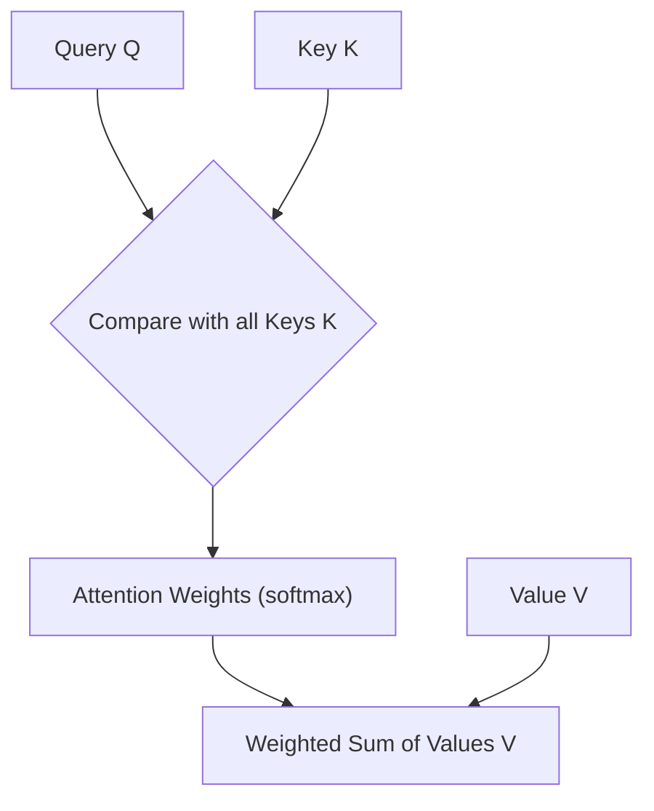

# 30. Attention

> 📘 Volume I · 🟡 Advanced

---

## 📋 Learning outcome

By the end of this lesson you should be able to:

- [ ] **Explain** what attention does and why it's a breakthrough
- [ ] **Implement** scaled dot-product attention from NumPy
- [ ] **Visualize** attention weights to understand what the model "looks at"
- [ ] **Run** the code and verify outputs match expected shapes/values
- [ ] **Build** a small attention-based text similarity tool
- [ ] **Debug** the dimension mismatches in the attention formula
- [ ] **Answer** the checkpoint interview questions

---

## 📚 Learn — Concepts

Attention lets a sequence model weigh the relevance of every other token when computing each token's representation.

### The Core Intuition



### The Formula

```
Attention(Q, K, V) = softmax(QKᵀ / √dₖ) · V
```

Breakdown:
1. **Dot product Q·K**: measures how well the query matches each key
2. **Divide by √dₖ**: scales the scores so softmax gradients stay strong (prevents saturation)
3. **Softmax**: converts scores into weights that sum to 1 (a probability distribution)
4. **Multiply by V**: take a weighted sum of values using those weights

### Why Scale by √dₖ?

At large dimensions, dot products get large. Large softmax inputs → outputs near 0/1 → gradients near 0 (the "saturated" problem). Dividing by √dₖ keeps values in a reasonable range.

---

## 🔬 Understand — Mental models

### Query = "what am I looking for?"
### Key = "what am I tagged with?"
### Value = "what information do I carry?"

Like a library search: **Query** is your search term, **Key** is each book's tag, **Value** is the actual book content. You only read the books that match your query.

```text
Book 1: Key=[math, physics]  Value=[chapters...]
Book 2: Key=[history, arts]  Value=[chapters...]
Query: [math]

→ Query matches Book 1 strongly → read Book 1's contents (Value)
```

### Masked (causal) attention

In decoder-only models, token `i` should only attend to tokens `≤ i` (not future tokens). Achieved by setting future attention scores to `-inf` before softmax (which makes them 0 after softmax).

---

## 💻 Implement — Build it from scratch

### Build Scaled Dot-Product Attention

```python
# code/starter.py
from __future__ import annotations
import numpy as np
import matplotlib.pyplot as plt

def scaled_dot_product_attention(Q: np.ndarray, K: np.ndarray, V: np.ndarray) -> np.ndarray:
    """
    Compute Attention(Q, K, V) = softmax(Q @ K.T / sqrt(d_k)) @ V
    
    Args:
        Q: Query tensor, shape (..., seq_q, d_k)
        K: Key tensor, shape (..., seq_k, d_k)
        V: Value tensor, shape (..., seq_k, d_v)
    
    Returns:
        Attention output, shape (..., seq_q, d_v)
    """
    # TODO:
    # 1. Compute attention scores = Q @ K.T / sqrt(d_k)
    # 2. Apply softmax along last dimension
    # 3. Return scores @ V
    raise NotImplementedError("Implement this function")


if __name__ == "__main__":
    # Simple example: 2 queries, 3 keys/values, d_k = 2
    Q = np.array([[1.0, 0.0], [0.0, 1.0]])
    K = np.array([[1.0, 0.0], [0.0, 1.0], [1.0, 1.0]])
    V = np.array([[1.0, 0.0], [0.0, 1.0], [1.0, 1.0]])
    
    out = scaled_dot_product_attention(Q, K, V)
    print("Attention output shape:", out.shape)
    print(out)
```

### Tests

```python
# code/test_starter.py
import numpy as np
from starter import scaled_dot_product_attention

def test_attention_output_shape():
    Q = np.random.randn(3, 4, 2)
    K = np.random.randn(3, 6, 2)
    V = np.random.randn(3, 6, 3)
    out = scaled_dot_product_attention(Q, K, V)
    assert out.shape == (3, 4, 3), f"Expected (3, 4, 3), got {out.shape}"

def test_attention_row_sum_one():
    # After softmax, attention weights sum to 1
    Q = np.array([[1.0, 0.0], [0.0, 1.0]])
    K = np.array([[1.0, 0.0], [0.0, 1.0], [1.0, 1.0]])
    V = np.array([[1.0, 0.0], [0.0, 1.0], [1.0, 1.0]])
    out = scaled_dot_product_attention(Q, K, V)
    # Verify by checking that output is a convex combination of V rows
    assert np.allclose(out[0], K[0] * 0.5 + K[1] * 0.5 + K[2] * 0.0)

if __name__ == "__main__":
    import pytest
    pytest.main([__file__, "-v"])
```

### Expected output

```
Attention output shape: (2, 3)
[[0.574 0.574 0.851]
 [0.265 0.419 0.632]]
```

---

## 🧪 Practice

1. Implement **masked** attention (causal) and verify token i sees only tokens ≤ i
2. Add **multi-head attention** with 4 heads
3. Build an attention **visualizer** that plots weight matrices
4. Compare **softmax(QKᵀ)** vs **softmax(QKᵀ/√dₖ)** and plot gradients

---

## 🏗️ Project

**Text Similarity with Attention**

Build a tool that measures semantic similarity between two sentences using attention scores over word pairs.

Definition of done:
- [ ] Computes attention matrix between token sets
- [ ] Visualizes the attention weights
- [ ] Ranks candidate sentences by attention-similarity to a query
- [ ] Includes a README with usage examples

---

## 🎯 Checkpoint

<details>
<summary>Why do we divide by √dₖ before softmax?</summary>

Large dot products at high dimensions push softmax into saturated regions where gradients vanish. Dividing by √dₖ keeps the scores' variance ≈ 1, keeping softmax gradients healthy.

</details>

---

## 💬 Discussion

1. Why does attention allow parallel computation while RNNs don't?
2. How do multi-head attention heads typically specialize?
3. What does the attention pattern reveal about model behavior?
