# 🗺️ AI Systems Engineer Handbook — Complete Curriculum

> **From Python fundamentals to production-grade AI systems.**

The **AI Systems Engineer Handbook** is a structured, project-driven learning path for engineers who want to understand how modern AI systems actually work — from the operating system and network layer all the way to LLMs, RAG, agents, MCP, distributed infrastructure, and production deployment.

The curriculum is designed around one principle:

> **Understand the system before using the abstraction.**

You should not merely learn how to call an LLM API.

You should understand:

- what happens when a request enters a system
- how data moves through services
- how models process tokens
- how retrieval works
- how agents make decisions
- how tools are executed
- how systems fail
- how to evaluate AI quality
- how to observe production workloads
- how to scale the system
- how to control cost
- how to secure it

---

# 🎯 Curriculum Philosophy

This handbook follows a progressive model:

```mermaid
flowchart LR

    A[Computer Science]
    --> B[Software Engineering]

    B --> C[Machine Learning]

    C --> D[Deep Learning]

    D --> E[Transformers]

    E --> F[LLM Engineering]

    F --> G[RAG]

    G --> H[AI Agents]

    H --> I[Multi-Agent Systems]

    I --> J[MCP]

    J --> K[Production AI]

    K --> L[Distributed Systems]

    L --> M[System Design]

    M --> N[Capstone Projects]
```

Every major topic follows:

```text
Theory
   ↓
First-Principles Implementation
   ↓
Small Exercises
   ↓
Practical Project
   ↓
Production Considerations
   ↓
Evaluation
   ↓
System Design
```

---

# 🧭 How to Use This Curriculum

Each chapter contains:

### 📚 Learn

The concepts you need to understand.

### 🔬 Understand

First-principles explanations and mental models.

### 💻 Implement

Things you should build yourself.

### 🧪 Practice

Exercises designed to reinforce the concepts.

### 🏗️ Project

A larger project combining the concepts.

### 🚀 Production

Real-world engineering considerations.

### 🎯 Checkpoint

A test for determining whether you actually understand the topic.

---

# 🏆 Curriculum Overview

| Volume | Focus                            | Difficulty  |
| ------ | -------------------------------- | ----------- |
| I      | Computer Science & Python        | 🟢 Beginner |
| II     | Machine Learning & Deep Learning | 🟢 → 🟡     |
| III    | LLM Engineering                  | 🟡          |
| IV     | Retrieval-Augmented Generation   | 🟡          |
| V      | Agentic & Multi-Agent AI         | 🟡 → 🔴     |
| VI     | Model Context Protocol           | 🟡 → 🔴     |
| VII    | Production AI Infrastructure     | 🔴          |
| VIII   | AI System Design & Capstones     | 🔴          |

---

# 📘 Volume I — Computer Science & Python

> **Build the engineering foundation.**

AI Systems Engineers are software engineers first.

Before building agents and RAG pipelines, you need to understand the machinery underneath them.

---

# 1. Python Fundamentals

## Learn

- Python syntax
- Variables
- Primitive types
- Strings
- Lists
- Tuples
- Sets
- Dictionaries
- Conditionals
- Loops
- Functions
- Scope
- Modules
- Packages
- Exceptions
- File I/O

## Understand

```text
Python Program
      ↓
Python Interpreter
      ↓
Bytecode
      ↓
Python Virtual Machine
      ↓
Operating System
```

## Implement

Build:

- calculator
- todo CLI
- file organizer
- password generator
- log parser
- CSV processor
- JSON processor

## Practice

### Exercise 1

Create a CLI calculator.

### Exercise 2

Create a program that analyzes a log file.

Return:

```text
Total requests
Successful requests
Failed requests
Average response time
Most common error
```

### Exercise 3

Build a JSON-based configuration loader.

---

# 2. Python Type System

## Learn

- Type hints
- `Optional`
- `Union`
- `Literal`
- `TypedDict`
- Generics
- Protocols
- Type aliases
- Static type checking

## Tools

- `typing`
- mypy
- pyright

## Project

Build a strongly typed configuration system.

---

# 3. Object-Oriented Programming

## Learn

- Classes
- Objects
- Inheritance
- Composition
- Encapsulation
- Abstraction
- Polymorphism

## Understand

Prefer:

```text
Composition
```

when inheritance is unnecessary.

## Project

Build a:

```text
Payment Processing System
```

with:

```text
PaymentProvider
 ├── StripeProvider
 ├── PayPalProvider
 └── MockProvider
```

---

# 4. Advanced Python

## Learn

- Iterators
- Generators
- Decorators
- Context managers
- Descriptors
- Dataclasses
- Enums
- Closures
- `__dunder__` methods

## Build

Create:

```text
@retry
@timer
@cache
@validate
```

decorators.

Build your own context manager.

---

# 5. Async Python

## Learn

- Event loops
- Coroutines
- `async`
- `await`
- Tasks
- Futures
- Concurrent execution
- Async HTTP
- Async database access

## Mental Model

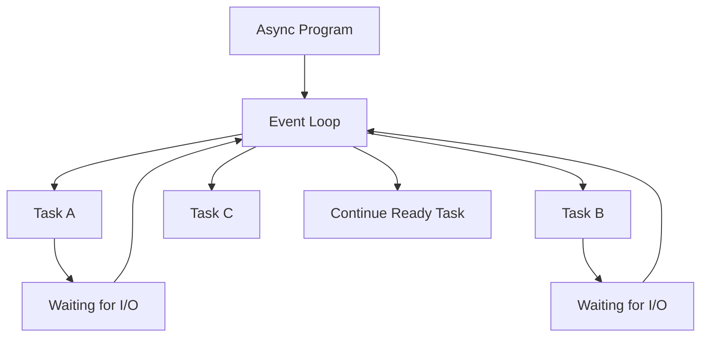

## Project

Build an asynchronous web crawler.

Requirements:

- concurrent requests
- retry handling
- timeout
- rate limiting
- caching
- structured logging

---

# 6. Concurrency

## Learn

- Processes
- Threads
- Async
- CPU-bound work
- I/O-bound work
- GIL
- multiprocessing
- worker pools

## Experiment

Benchmark:

```text
Sequential
Threading
Asyncio
Multiprocessing
```

against different workloads.

---

# 7. Memory Management

## Learn

- Stack
- Heap
- References
- Garbage collection
- Reference counting
- Memory leaks
- Object lifecycle

## Project

Build a memory profiler experiment.

Measure:

```text
Object count
Memory usage
Allocation growth
Garbage collection
```

---

# 8. Data Structures

## Learn

- Arrays
- Linked lists
- Stacks
- Queues
- Hash tables
- Trees
- Heaps
- Graphs
- Tries

## Implement From Scratch

```text
Dynamic Array
Linked List
Stack
Queue
Hash Map
Binary Search Tree
Heap
Graph
Trie
```

---

# 9. Algorithms

## Learn

### Searching

- Linear Search
- Binary Search

### Sorting

- Bubble Sort
- Selection Sort
- Insertion Sort
- Merge Sort
- Quick Sort
- Heap Sort

### Graph Algorithms

- BFS
- DFS
- Dijkstra
- Topological Sort

### Dynamic Programming

- Fibonacci
- Knapsack
- Longest Common Subsequence
- Coin Change

---

# 10. Complexity

Learn:

```text
O(1)
O(log n)
O(n)
O(n log n)
O(n²)
O(2ⁿ)
```

Understand:

```text
Time Complexity
Space Complexity
Amortized Complexity
```

---

# 11. Operating Systems

## Learn

- Processes
- Threads
- Scheduling
- Memory
- Virtual memory
- File systems
- System calls
- Signals
- IPC

## Understand

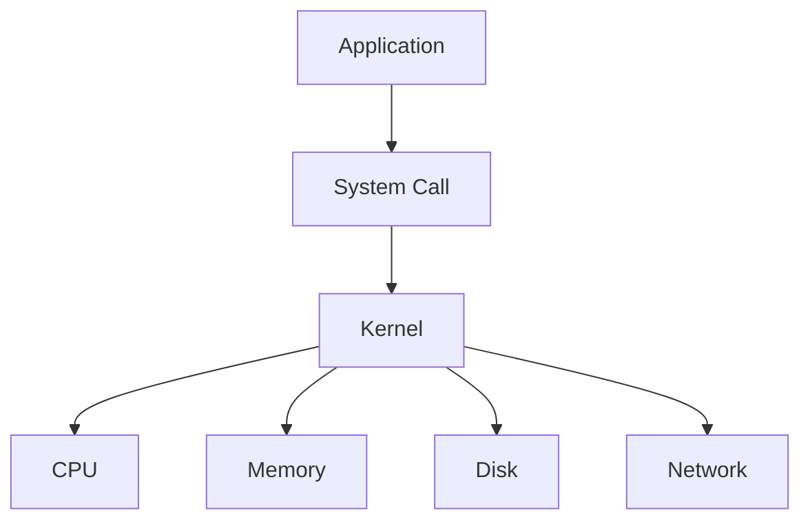

---

# 12. Linux

## Learn

- Filesystem
- Permissions
- Processes
- Signals
- Pipes
- Environment variables
- SSH
- Shell scripting
- Package management
- systemd
- Cron

## Commands

Master:

```bash
ls
cd
find
grep
awk
sed
cat
less
tail
ps
top
htop
kill
chmod
chown
curl
wget
ssh
scp
tar
systemctl
journalctl
```

## Project

Build a Linux system monitoring script.

---

# 13. Networking

## Learn

- IP
- TCP
- UDP
- DNS
- HTTP
- HTTPS
- TLS
- WebSockets
- REST
- gRPC

## Understand

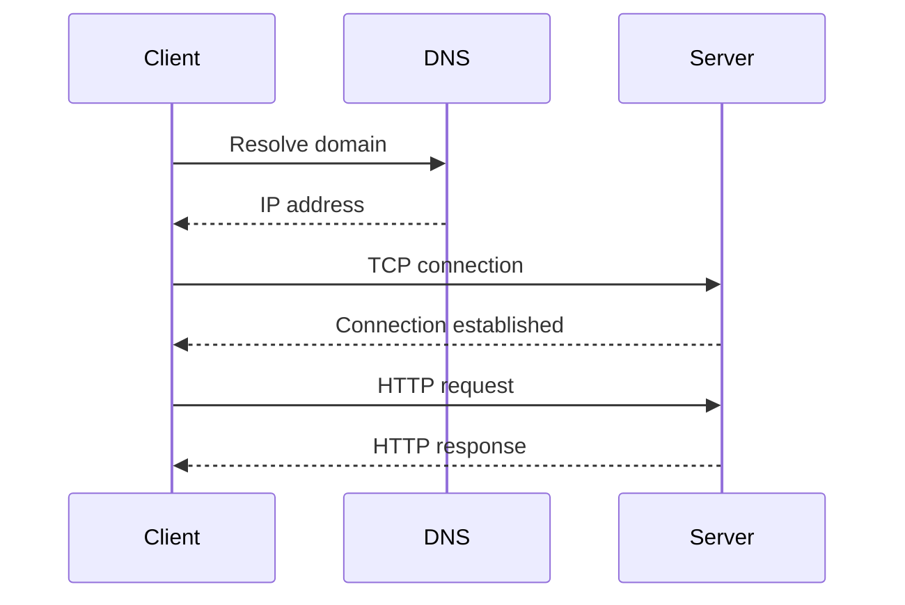

## Project

Build:

```text
HTTP Server from Scratch
```

Then build a small REST API.

---

# 14. Databases

## SQL

Learn:

- SELECT
- INSERT
- UPDATE
- DELETE
- JOIN
- GROUP BY
- HAVING
- Subqueries
- CTEs
- Window functions

## PostgreSQL

Learn:

- schemas
- indexes
- transactions
- constraints
- isolation
- query planning

## Understand

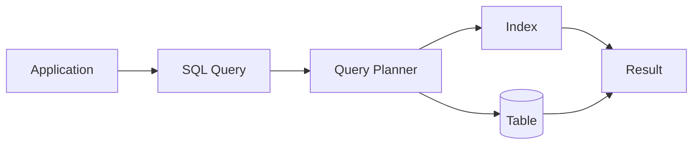

---

# 15. Transactions

Learn:

```text
Atomicity
Consistency
Isolation
Durability
```

Understand:

- dirty reads
- non-repeatable reads
- phantom reads
- locking
- deadlocks

---

# 16. Redis

Learn:

- caching
- TTL
- pub/sub
- streams
- distributed locks
- rate limiting

## Project

Build:

```text
API
 ↓
Redis Cache
 ↓
PostgreSQL
```

Measure cache hit ratio.

---

# 17. Software Engineering

Learn:

- SOLID
- DRY
- KISS
- YAGNI
- clean architecture
- dependency injection
- design patterns
- refactoring

---

# 18. Testing

Learn:

- unit testing
- integration testing
- end-to-end testing
- mocks
- fixtures
- property-based testing

Tools:

```text
pytest
pytest-asyncio
hypothesis
```

## Project

Add tests to every previous project.

---

# 19. Git

Master:

```text
clone
branch
commit
merge
rebase
stash
cherry-pick
revert
reset
bisect
```

Learn:

- Git internals
- branching strategies
- pull requests
- code review

---

# 20. Docker

Learn:

- images
- containers
- volumes
- networks
- Dockerfile
- Compose
- registries

## Project

Containerize:

```text
FastAPI
PostgreSQL
Redis
```

using Docker Compose.

---

# 📘 Volume I Final Project

# 🏗️ Production-Style Backend

Build:

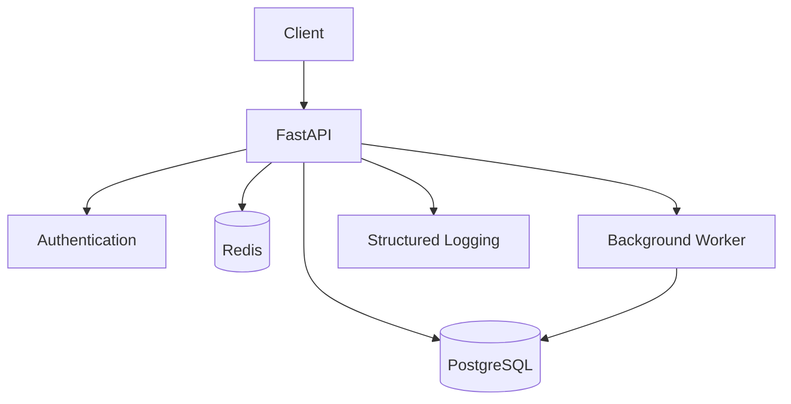

Features:

- authentication
- CRUD API
- PostgreSQL
- Redis
- background jobs
- tests
- Docker
- logging
- configuration

---

# 📗 Volume II — Machine Learning & Deep Learning

> **Understand how models learn.**

---

# 21. Mathematics

## Linear Algebra

Learn:

- vectors
- matrices
- tensors
- dot product
- matrix multiplication
- transpose
- inverse
- eigenvalues
- eigenvectors
- norms

## Probability

Learn:

- probability
- conditional probability
- Bayes theorem
- random variables
- distributions
- expectation
- variance

## Statistics

Learn:

- mean
- median
- variance
- standard deviation
- covariance
- correlation
- hypothesis testing
- confidence intervals

## Calculus

Learn:

- derivatives
- partial derivatives
- gradients
- chain rule

## Optimization

Learn:

- gradient descent
- stochastic gradient descent
- momentum
- Adam

---

# 22. NumPy

Learn:

- arrays
- broadcasting
- vectorization
- matrix operations
- numerical computation

## Project

Implement linear regression using NumPy only.

---

# 23. Classical Machine Learning

Learn:

### Supervised Learning

- Linear Regression
- Logistic Regression
- Decision Trees
- Random Forest
- Gradient Boosting
- XGBoost

### Unsupervised Learning

- K-Means
- DBSCAN
- PCA

---

# 24. ML Evaluation

Learn:

### Classification

```text
Accuracy
Precision
Recall
F1
ROC-AUC
PR-AUC
```

### Regression

```text
MAE
MSE
RMSE
R²
```

Understand:

```text
Train
Validation
Test
```

and:

```text
Underfitting
Overfitting
Bias
Variance
```

---

# 25. PyTorch

Learn:

- tensors
- datasets
- dataloaders
- autograd
- modules
- optimizers
- loss functions
- training loops
- GPU execution

## First-Principles Training Loop

```python
for x, y in dataloader:

    optimizer.zero_grad()

    prediction = model(x)

    loss = loss_fn(prediction, y)

    loss.backward()

    optimizer.step()
```

Understand every line.

---

# 26. Neural Networks

Implement:

```text
Perceptron
MLP
Activation Functions
Loss Functions
Backpropagation
```

Implement a neural network **without PyTorch autograd** once.

---

# 27. Computer Vision

Learn:

- convolution
- pooling
- CNNs
- image classification
- object detection
- segmentation

## Project

Build an image classifier.

---

# 28. NLP Foundations

Learn:

- tokenization
- vocabulary
- bag of words
- TF-IDF
- embeddings
- sequence models

---

# 29. RNNs and LSTMs

Understand:

- hidden state
- sequence processing
- vanishing gradients
- exploding gradients
- LSTM gates

---

# 30. Attention

This is a critical transition.

Understand:

```text
Query
Key
Value
```

and:

```text
Attention(Q,K,V)
=
softmax(QKᵀ / √dₖ)V
```

Implement scaled dot-product attention using NumPy.

---

# 31. Transformers

Understand:

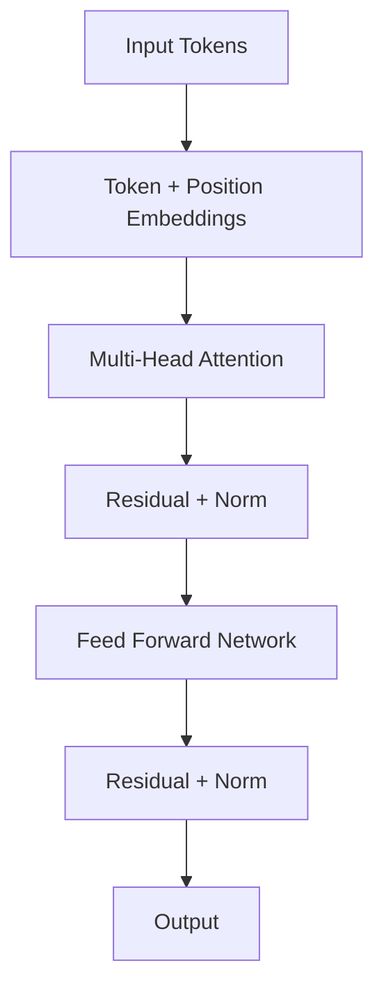

Learn:

- self-attention
- multi-head attention
- positional encoding
- encoder
- decoder
- causal masking
- residual connections
- layer normalization

---

# 📗 Volume II Final Projects

Build:

1. Digit classifier
2. Image classifier
3. Sentiment classifier
4. Text generator
5. Mini Transformer

---

# 📙 Volume III — LLM Engineering

> **Understand and engineer modern language-model applications.**

---

# 32. Tokenization

Learn:

- tokens
- vocabulary
- BPE
- WordPiece
- SentencePiece
- token IDs
- special tokens

## Project

Implement a basic tokenizer.

---

# 33. Embeddings

Understand:

```text
Text
 ↓
Tokenizer
 ↓
Model
 ↓
Vector
```

Learn:

- semantic similarity
- cosine similarity
- vector spaces
- embedding dimensions

---

# 34. LLM Architecture

Understand:

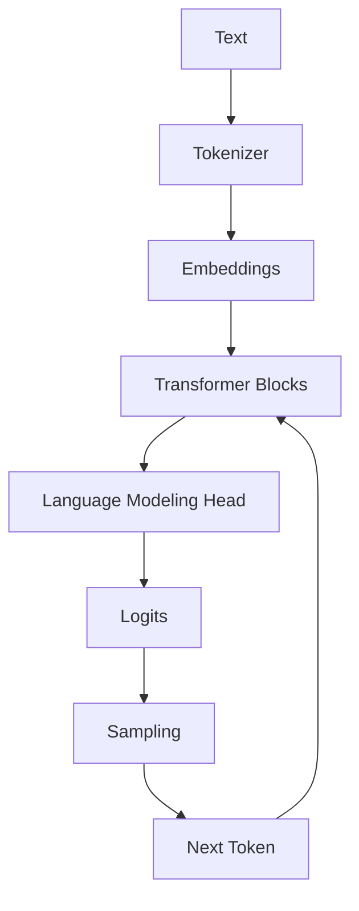

---

# 35. Next Token Prediction

Understand:

```text
P(tokenₜ | token₁ ... tokenₜ₋₁)
```

Learn:

- logits
- softmax
- temperature
- top-k
- top-p
- greedy decoding
- beam search

---

# 36. Context Windows

Learn:

- context length
- prompt tokens
- completion tokens
- KV cache
- context truncation

Understand why:

```text
More Context ≠ Automatically Better Answers
```

---

# 37. Prompt Engineering

Learn:

- system instructions
- few-shot prompting
- role prompting
- structured prompting
- chain-of-thought considerations
- constraints
- output schemas

Focus on:

```text
Clear Input
+
Explicit Constraints
+
Expected Output
+
Relevant Context
```

---

# 38. Structured Outputs

Learn:

- JSON schemas
- validation
- Pydantic
- constrained generation

## Project

Build:

```text
Natural Language
      ↓
LLM
      ↓
Structured JSON
      ↓
Pydantic Validation
```

---

# 39. Function / Tool Calling

Understand:

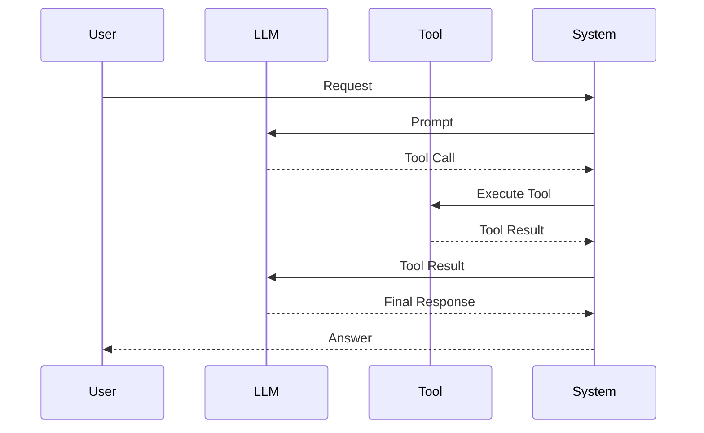

---

# 40. LLM Evaluation

Learn:

- exact match
- semantic similarity
- human evaluation
- LLM-as-judge
- task-specific metrics
- hallucination evaluation
- factuality
- consistency

---

# 41. Fine-Tuning

Understand:

- pretraining
- supervised fine-tuning
- instruction tuning
- LoRA
- QLoRA
- adapters

Learn when fine-tuning is appropriate.

---

# 42. Quantization

Learn:

```text
FP32
FP16
BF16
INT8
INT4
```

Understand the trade-off:

```text
Memory
Accuracy
Latency
Throughput
```

---

# 43. Inference

Learn:

- batching
- continuous batching
- KV cache
- streaming
- speculative decoding
- model serving

---

# 📙 Volume III Projects

Build:

### Project 1

AI Chatbot

### Project 2

Streaming Chat API

### Project 3

Structured Data Extraction API

### Project 4

AI Email Assistant

### Project 5

Mini LLM inference server

### Project 6

LLM Gateway

---

# 📕 Volume IV — Retrieval-Augmented Generation

> **Build reliable systems that combine language models with external knowledge.**

---

# 44. Why RAG?

LLMs have limitations:

```text
Knowledge Cutoff
      +
Private Data
      +
Changing Data
      +
Limited Context
```

RAG introduces:

```text
External Knowledge
       ↓
Retrieval
       ↓
Context
       ↓
Generation
```

---

# 45. Document Processing

Learn:

- PDF parsing
- HTML extraction
- Markdown
- DOCX
- OCR
- metadata
- document normalization

---

# 46. Chunking

Learn:

- fixed-size chunks
- sentence chunks
- paragraph chunks
- semantic chunking
- recursive chunking
- overlap

Understand:

```text
Too Small
→ Missing Context

Too Large
→ Retrieval Noise
```

---

# 47. Embedding Models

Learn:

- dense embeddings
- semantic similarity
- cosine similarity
- embedding dimensions

---

# 48. Vector Databases

Learn:

- vector indexing
- similarity search
- metadata filtering
- approximate nearest neighbors

Technologies to understand:

```text
pgvector
FAISS
Qdrant
Milvus
Weaviate
```

Do not learn them as isolated products.

Understand the underlying retrieval problem first.

---

# 49. BM25

Understand lexical retrieval.

Compare:

```text
Keyword Search
```

with:

```text
Semantic Search
```

---

# 50. Hybrid Search

Understand:

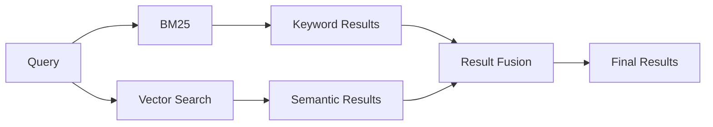

---

# 51. Reranking

Learn:

```text
Retrieve many
      ↓
Rerank
      ↓
Keep best
      ↓
Send context to LLM
```

Understand:

- bi-encoders
- cross-encoders
- reranking trade-offs

---

# 52. Context Compression

Learn:

- contextual compression
- relevance filtering
- redundancy removal
- query-focused extraction

---

# 53. Query Transformation

Learn:

- query rewriting
- multi-query retrieval
- hypothetical document embeddings
- decomposition

---

# 54. Advanced RAG

Study:

- Parent-child retrieval
- Hierarchical retrieval
- Self-query retrieval
- Hybrid retrieval
- Graph RAG
- Agentic RAG
- Corrective RAG

---

# 55. RAG Evaluation

Measure:

### Retrieval

```text
Recall
Precision
MRR
NDCG
Hit Rate
```

### Generation

```text
Faithfulness
Relevance
Correctness
Citation Accuracy
```

---

# 56. Production RAG Architecture

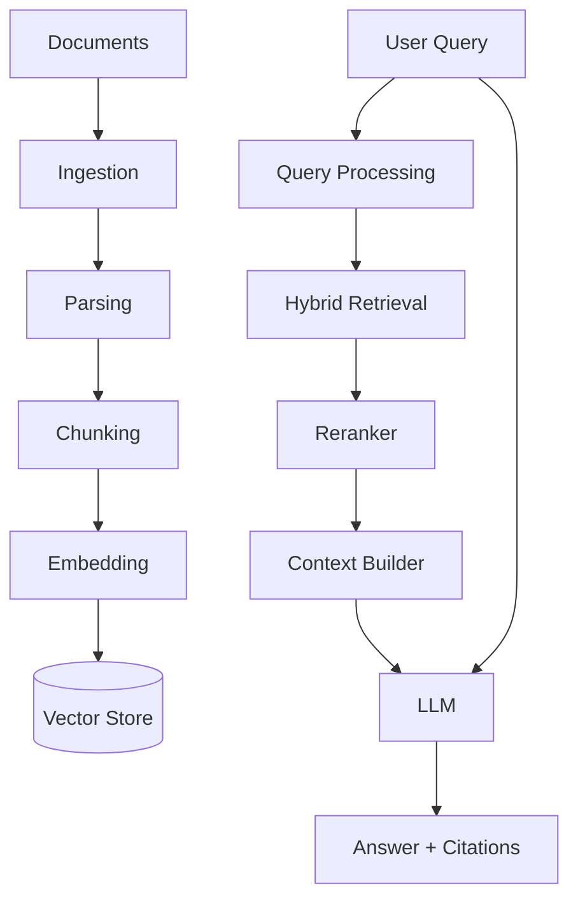

---

# 📕 Volume IV Projects

Build:

1. PDF RAG
2. Markdown Documentation RAG
3. Hybrid Search Engine
4. Enterprise Knowledge Base
5. Research Assistant
6. Legal Document Assistant
7. GraphRAG system
8. Production RAG API

---

# 📒 Volume V — Agentic AI & Multi-Agent Systems

> **Move from generating answers to accomplishing goals.**

---

# 57. What Is an Agent?

Core mental model:

```text
Goal
 ↓
Observe
 ↓
Reason
 ↓
Plan
 ↓
Act
 ↓
Observe
 ↓
Repeat
```

---

# 58. Agent Architecture

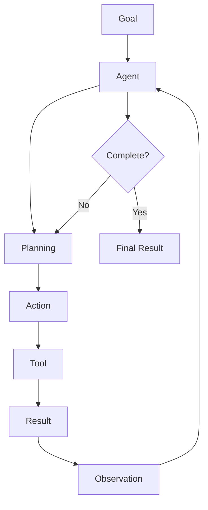

---

# 59. Tool Calling

Build tools for:

```text
Calculator
Web Search
Database
Filesystem
Python
HTTP APIs
Email
Calendar
GitHub
```

Understand:

```text
Tool Schema
      ↓
Tool Selection
      ↓
Argument Generation
      ↓
Validation
      ↓
Execution
      ↓
Result
```

---

# 60. Agent State

Learn:

- state
- context
- checkpoints
- persistence
- execution history

---

# 61. Agent Memory

Understand:

### Short-Term Memory

Current task context.

### Long-Term Memory

Persistent information.

### Semantic Memory

Facts.

### Episodic Memory

Past experiences.

---

# 62. Planning

Study:

- task decomposition
- planning
- replanning
- hierarchical planning
- iterative execution

---

# 63. Reflection

Understand:

```text
Generate
 ↓
Critique
 ↓
Improve
```

But also understand the cost and failure modes of repeated reasoning loops.

---

# 64. Human-in-the-Loop

Important for actions involving:

- money
- deletion
- external communication
- permissions
- production changes

Architecture:

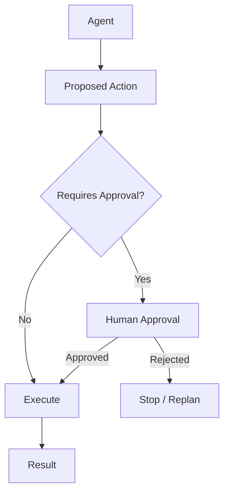

---

# 65. Multi-Agent Systems

Learn patterns:

```text
Supervisor
Router
Pipeline
Debate
Peer-to-Peer
Hierarchical
Specialist Agents
```

---

# 66. Multi-Agent Communication

Understand:

```text
Agent A
   ↓
Message
   ↓
Agent B
   ↓
Result
   ↓
Agent A
```

Study:

- shared state
- message passing
- event-driven agents
- task queues

---

# 67. Agent Reliability

Study:

- infinite loops
- tool errors
- malformed arguments
- hallucinated tools
- prompt injection
- excessive tool usage
- runaway costs
- state corruption

---

# 68. Agent Evaluation

Measure:

```text
Task Success
Tool Accuracy
Step Efficiency
Latency
Cost
Safety
Recovery Rate
```

---

# 📒 Volume V Projects

Build:

### Beginner

- Calculator Agent
- Research Agent
- File Agent

### Intermediate

- Browser Agent
- Coding Agent
- SQL Agent

### Advanced

- Multi-Agent Research Team
- AI Software Company
- Customer Support Agent
- Autonomous Workflow Engine

---

# 📓 Volume VI — Model Context Protocol

> **Connect AI applications to external systems through standardized interfaces.**

---

# 69. MCP Fundamentals

Learn:

- Host
- Client
- Server
- Tools
- Resources
- Prompts
- Transport
- Sessions

---

# 70. MCP Architecture

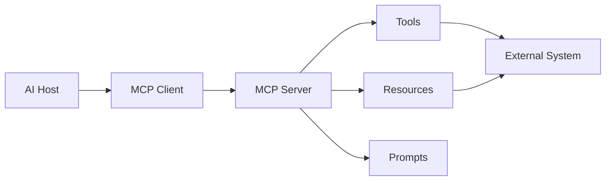

---

# 71. Build an MCP Server

Start with:

```text
Calculator MCP
```

Then:

```text
Filesystem MCP
PostgreSQL MCP
GitHub MCP
Slack MCP
Calendar MCP
```

---

# 72. MCP Security

Learn:

- authentication
- authorization
- least privilege
- input validation
- tool permissions
- secret management
- sandboxing

---

# 73. MCP Production Architecture

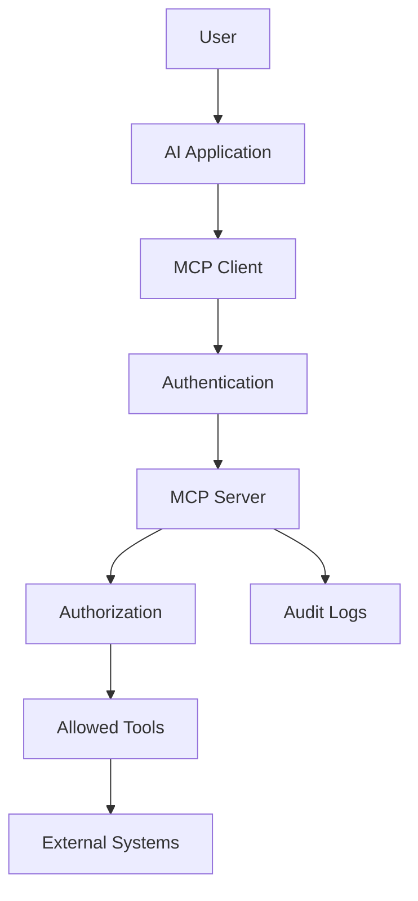

---

# 📓 Volume VI Projects

Build:

1. Calculator MCP
2. Filesystem MCP
3. PostgreSQL MCP
4. GitHub MCP
5. Slack MCP
6. Calendar MCP
7. Multi-server MCP application
8. Secure MCP gateway

---

# 📔 Volume VII — Production AI Infrastructure

> **Turn AI applications into reliable production systems.**

---

# 74. API Architecture

Learn:

- REST
- versioning
- authentication
- authorization
- pagination
- idempotency
- rate limiting
- retries
- timeouts

---

# 75. FastAPI

Build:

```text
GET
POST
PUT
PATCH
DELETE
```

Learn:

- dependency injection
- middleware
- background tasks
- async endpoints
- OpenAPI
- validation

---

# 76. Caching

Understand:

```text
Cache Aside
Write Through
Write Behind
Read Through
```

---

# 77. Message Queues

Learn:

- Kafka
- RabbitMQ
- Redis Streams

Understand:

```text
Producer
 ↓
Queue
 ↓
Consumer
```

---

# 78. Event-Driven Architecture

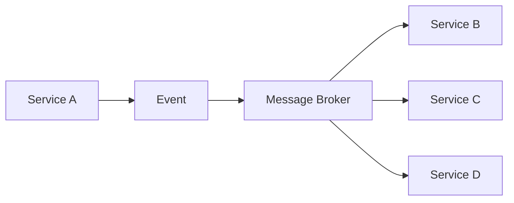

---

# 79. Distributed Systems

Learn:

- CAP theorem
- consistency
- availability
- partition tolerance
- replication
- sharding
- leader election
- consensus
- eventual consistency

---

# 80. Kubernetes

Learn:

- Pods
- Deployments
- Services
- ConfigMaps
- Secrets
- Ingress
- Volumes
- Jobs
- CronJobs
- Horizontal Pod Autoscaler

---

# 81. AI Inference Infrastructure

Study:

- GPU memory
- batching
- throughput
- latency
- model serving
- vLLM
- inference optimization

---

# 82. LLM Gateway

Build a gateway that supports:

```text
Application
 ↓
LLM Gateway
 ├── Model A
 ├── Model B
 ├── Model C
 └── Local Model
```

Features:

- routing
- retries
- fallbacks
- logging
- token tracking
- cost tracking
- rate limiting

---

# 83. Observability

Learn the three pillars:

```text
Logs
Metrics
Traces
```

Use:

```text
OpenTelemetry
Prometheus
Grafana
```

---

# 84. AI Observability

Track:

```text
Request latency
Token usage
Model
Prompt size
Completion size
Cost
Tool calls
Retrieval results
Agent steps
Errors
```

---

# 85. Reliability

Learn:

- timeouts
- retries
- exponential backoff
- circuit breakers
- bulkheads
- graceful degradation
- health checks

---

# 86. Security

Study:

```text
Authentication
Authorization
Secrets
Encryption
Network Security
Input Validation
Prompt Injection
Data Leakage
Supply Chain Security
```

---

# 87. AI Security

Understand:

### Prompt Injection

```text
Untrusted Input
      ↓
Model
      ↓
Malicious Instruction
```

### Tool Abuse

```text
User Input
 ↓
Agent
 ↓
Sensitive Tool
 ↓
Unauthorized Action
```

Learn defensive architecture.

---

# 88. Cost Engineering

Track:

```text
Tokens
GPU Time
Database
Storage
Network
API Calls
```

Understand:

```text
Cost per request
Cost per user
Cost per workflow
Cost per successful task
```

---

# 📔 Volume VII Projects

Build:

1. Production FastAPI service
2. Redis caching layer
3. Background worker system
4. Kafka event pipeline
5. Kubernetes deployment
6. LLM Gateway
7. GPU inference server
8. AI observability platform
9. Multi-model router
10. Distributed AI platform

---

# 📖 Volume VIII — AI System Design

> **Learn to design complete AI systems.**

---

# 89. System Design Fundamentals

For every system answer:

```text
Requirements
 ↓
Constraints
 ↓
Traffic
 ↓
Data
 ↓
APIs
 ↓
Architecture
 ↓
Storage
 ↓
Caching
 ↓
Queues
 ↓
AI Components
 ↓
Failure Modes
 ↓
Security
 ↓
Observability
 ↓
Scaling
 ↓
Cost
```

---

# 90. AI System Design Framework

When designing an AI system ask:

### 1. What is the task?

### 2. Does the system require knowledge retrieval?

### 3. Does it require tools?

### 4. Does it require autonomous planning?

### 5. What data does it need?

### 6. What model should be used?

### 7. How will outputs be evaluated?

### 8. What happens when the model fails?

### 9. What happens when a tool fails?

### 10. How will the system scale?

---

# 91. System Design: RAG

Design:

```text
Enterprise Knowledge Base
```

Consider:

- ingestion
- chunking
- embeddings
- retrieval
- reranking
- citations
- permissions
- evaluation
- caching

---

# 92. System Design: AI Search

Design:

```text
Search Engine
```

Components:

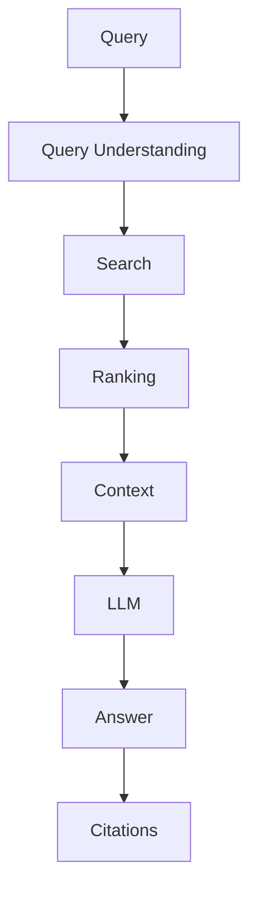

---

# 93. System Design: Coding Agent

Design:

```text
User
 ↓
Coding Agent
 ↓
Repository
 ↓
Planner
 ↓
Code Generator
 ↓
Tests
 ↓
Execution Sandbox
 ↓
Evaluation
 ↓
Patch
```

---

# 94. System Design: Customer Support AI

Components:

```text
User
 ↓
API
 ↓
Authentication
 ↓
Conversation
 ↓
RAG
 ↓
Agent
 ├── CRM
 ├── Orders
 ├── Refunds
 └── Knowledge Base
```

---

# 95. System Design: AI Analytics

Design:

```text
User Question
      ↓
Agent
      ↓
SQL Generation
      ↓
SQL Validation
      ↓
Database
      ↓
Result
      ↓
Analysis
      ↓
Visualization
```

---

# 96. System Design: Multi-Agent Research Platform

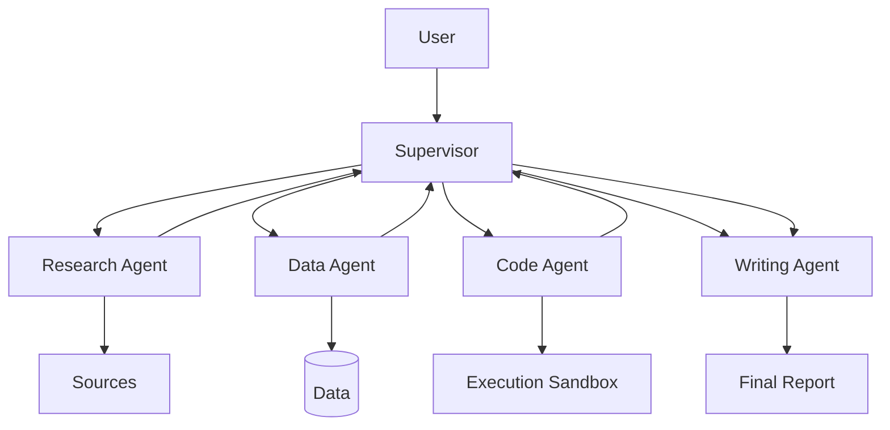

---

# 🏆 Final Capstone Projects

The final projects should combine multiple volumes.

---

# Capstone 1 — AI Knowledge Platform

### Features

- authentication
- document upload
- document processing
- embeddings
- hybrid retrieval
- reranking
- citations
- conversations
- evaluation
- observability

Architecture:

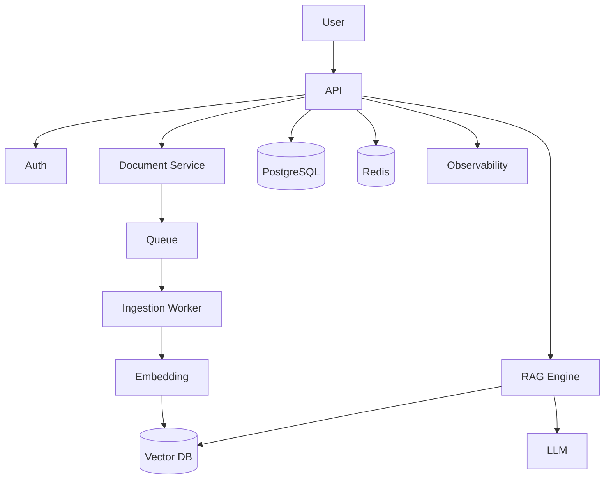

---

# Capstone 2 — AI Coding Agent

Build an agent capable of:

- reading repositories
- searching code
- modifying files
- running tests
- inspecting failures
- proposing fixes

Security requirement:

> Execute generated code inside an isolated sandbox.

---

# Capstone 3 — AI Research Platform

Agents:

```text
Planner
Researcher
Searcher
Data Analyst
Critic
Writer
```

Pipeline:

```text
Question
 ↓
Planner
 ↓
Research
 ↓
Data Analysis
 ↓
Critique
 ↓
Synthesis
 ↓
Final Report
```

---

# Capstone 4 — Enterprise Customer Support AI

Features:

- RAG
- customer authentication
- CRM tools
- order lookup
- refund workflow
- human approval
- agent memory
- monitoring
- evaluation

---

# Capstone 5 — AI Analytics Platform

Users can ask:

> "What were our highest-performing products last quarter?"

System:

```text
Natural Language
 ↓
Agent
 ↓
Schema Discovery
 ↓
SQL Generation
 ↓
SQL Validation
 ↓
Database
 ↓
Analysis
 ↓
Visualization
```

---

# Capstone 6 — AI Platform

Build a complete AI platform containing:

```text
API Gateway
LLM Gateway
RAG
Agents
MCP
Vector Database
PostgreSQL
Redis
Message Queue
Workers
Observability
Authentication
Evaluation
Kubernetes
```

---

# 🧪 Engineering Challenges

Throughout the curriculum, complete these challenges.

---

## Challenge 1 — Build an HTTP Server

No framework.

---

## Challenge 2 — Build a Database

Implement a tiny in-memory database.

---

## Challenge 3 — Build a Cache

Implement:

```text
GET
SET
DELETE
TTL
```

---

## Challenge 4 — Build a Vector Search Engine

Implement:

```text
Embedding
 ↓
Cosine Similarity
 ↓
Top-K
```

---

## Challenge 5 — Build Attention

Implement scaled dot-product attention.

---

## Challenge 6 — Build a Transformer Block

Implement:

```text
Attention
+
Residual
+
LayerNorm
+
FeedForward
```

---

## Challenge 7 — Build RAG Without a Framework

Use:

```text
Python
+
Embeddings
+
Vector Search
+
LLM
```

No LangChain.

---

## Challenge 8 — Build an Agent Without a Framework

Implement:

```text
while not finished:

    observe()

    reason()

    choose_tool()

    execute_tool()

    update_state()
```

---

## Challenge 9 — Build an MCP Server

Expose your own tool through MCP.

---

## Challenge 10 — Deploy Everything

Deploy a complete AI application with:

```text
Docker
PostgreSQL
Redis
FastAPI
Worker
LLM
RAG
Observability
```

---

# 📊 Final Skill Matrix

By the end of the curriculum, you should be comfortable with:

| Area                | Beginner | Intermediate | Advanced |
| ------------------- | -------: | -----------: | -------: |
| Python              |        ✓ |            ✓ |        ✓ |
| Algorithms          |        ✓ |            ✓ |          |
| Linux               |        ✓ |            ✓ |        ✓ |
| Networking          |        ✓ |            ✓ |        ✓ |
| Databases           |        ✓ |            ✓ |        ✓ |
| APIs                |        ✓ |            ✓ |        ✓ |
| Docker              |        ✓ |            ✓ |        ✓ |
| ML                  |        ✓ |            ✓ |          |
| Deep Learning       |        ✓ |            ✓ |        ✓ |
| Transformers        |          |            ✓ |        ✓ |
| LLMs                |          |            ✓ |        ✓ |
| RAG                 |          |            ✓ |        ✓ |
| Agents              |          |            ✓ |        ✓ |
| Multi-Agent         |          |              |        ✓ |
| MCP                 |          |            ✓ |        ✓ |
| Distributed Systems |          |            ✓ |        ✓ |
| Kubernetes          |          |            ✓ |        ✓ |
| AI Infrastructure   |          |            ✓ |        ✓ |
| AI Evaluation       |          |            ✓ |        ✓ |
| AI Security         |          |            ✓ |        ✓ |
| System Design       |          |            ✓ |        ✓ |

---

# 🧠 The Final Mental Model

The entire curriculum can be reduced to one architecture:

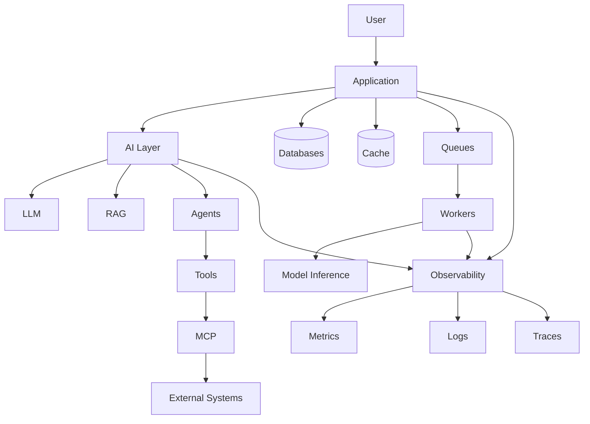

The engineer who understands this entire chain can reason about AI systems at the system level rather than only at the model level.

---

# 📚 Resource Strategy

The handbook should remain self-contained.

Every chapter should eventually contain:

```text
README.md
    │
    ├── Concepts
    ├── Mental Models
    ├── Diagrams
    ├── From-Scratch Implementation
    ├── Exercises
    ├── Production Considerations
    ├── Project
    ├── Interview Questions
    └── Further Reading
```

The repository should not simply tell readers:

> "Go read this external article."

Instead, external resources should be used to provide:

- primary documentation
- original research
- deeper exploration
- alternative explanations
- production references

The core learning material should live inside this repository.

---

# 📚 Recommended Resource Categories

Use primary sources wherever possible.

## Programming

- Python documentation
- Python Enhancement Proposals
- Real Python for supplementary explanations

## Computer Science

- MIT OpenCourseWare
- Stanford course material
- Berkeley course material

## Machine Learning

- Stanford CS229
- Mathematics for Machine Learning
- scikit-learn documentation

## Deep Learning

- PyTorch documentation
- Stanford CS231n
- Stanford CS224n

## Transformers

- Original Transformer paper
- Hugging Face documentation
- The Illustrated Transformer

## LLMs

- Original model papers
- Hugging Face documentation
- Model provider documentation

## RAG

- Original retrieval papers
- Vector database documentation
- Information retrieval literature

## Agents

- Original agent research
- Framework documentation
- Production engineering case studies

## MCP

- Official MCP specification
- Official SDK documentation
- Security documentation

## Infrastructure

- Docker documentation
- Kubernetes documentation
- PostgreSQL documentation
- Redis documentation
- Kafka documentation
- OpenTelemetry documentation

---

# 🔗 Resource Policy

Because AI changes rapidly, links should be maintained carefully.

Prefer:

```text
Official Documentation
        ↓
Original Research
        ↓
University Course
        ↓
Established Technical Resource
        ↓
Community Tutorial
```

Do not build the curriculum around a single framework.

Frameworks change.

Fundamentals remain.

---

# 🔄 Curriculum Update Policy

AI engineering evolves rapidly.

This curriculum should therefore distinguish between:

### Stable Knowledge

Examples:

- networking
- operating systems
- databases
- algorithms
- probability
- linear algebra
- attention

### Fast-Moving Knowledge

Examples:

- model APIs
- agent frameworks
- inference engines
- MCP tooling
- vector databases
- orchestration frameworks

Stable concepts should form the foundation.

Fast-moving technologies should be treated as implementations of those concepts.

---

# 🎯 Definition of Done

You should not consider a topic complete merely because you have read it.

A topic is complete when you can:

```text
Explain it
   +
Implement it
   +
Debug it
   +
Measure it
   +
Explain its trade-offs
   +
Use it in a larger system
```

For example:

### RAG

You should be able to explain:

```text
Why retrieval is needed
How embeddings work
How chunking affects retrieval
How vector search works
How hybrid search works
How reranking works
How RAG fails
How to evaluate RAG
How to deploy RAG
```

### Agents

You should be able to explain:

```text
What an agent is
How tool calling works
How state is maintained
How planning works
How memory works
How agents fail
How to evaluate agents
How to secure agents
How to operate agents
```

---

# 🏁 Final Destination

The final objective of this handbook is not to turn readers into framework users.

It is to develop engineers capable of reasoning about complete AI systems.

From:

```text
CPU
 ↓
Operating System
 ↓
Process
 ↓
Network
 ↓
API
 ↓
Database
 ↓
Machine Learning
 ↓
Neural Network
 ↓
Transformer
 ↓
LLM
 ↓
Retrieval
 ↓
RAG
 ↓
Agent
 ↓
Tool
 ↓
MCP
 ↓
Distributed System
 ↓
Production Infrastructure
```

The deeper you understand each layer, the better you can design the layer above it.

---

# 🧭 The AI Systems Engineer

A mature AI Systems Engineer should be able to move between these levels:

```mermaid
flowchart TD

    L1[Code]
    --> L2[Application]

    L2 --> L3[AI Component]

    L3 --> L4[Service]

    L4 --> L5[Distributed System]

    L5 --> L6[Production Platform]

    L6 --> L7[System Architecture]

    L7 --> L8[Business / Product Requirements]
```

The goal is to understand the entire chain.

---

# 🚀 Start Building

If you are new:

```text
Python
 ↓
Computer Science
 ↓
Software Engineering
 ↓
Machine Learning
 ↓
Deep Learning
 ↓
Transformers
 ↓
LLMs
 ↓
RAG
 ↓
Agents
 ↓
MCP
 ↓
Production
 ↓
System Design
```

If you already have experience, start at the appropriate volume and use the earlier volumes as references.

---

# ⭐ The Core Principle

> **Don't just learn AI models. Learn the systems that make AI useful.**

```text
Learn
  ↓
Understand
  ↓
Implement
  ↓
Break
  ↓
Debug
  ↓
Measure
  ↓
Deploy
  ↓
Scale
  ↓
Teach
```

That is the journey from **AI Developer → AI Engineer → AI Systems Engineer**.

---

<div align="center">

# 🧠 AI Systems Engineer Handbook

### Learn the foundations. Build the systems. Understand the trade-offs

**Computer Science · ML · Deep Learning · LLMs · RAG · Agents · MCP · Infrastructure · System Design**

⭐ Star the repository · 🍴 Fork it · 🛠️ Build with it · 🤝 Contribute

</div>
