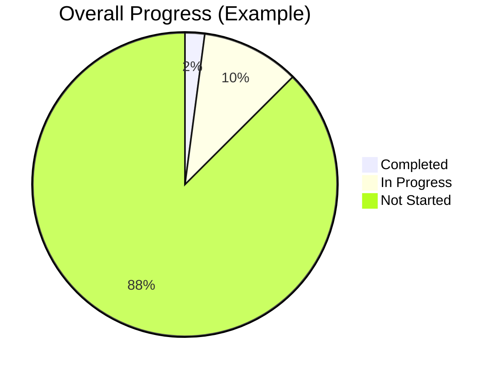

# 📈 Learning Progress Dashboard

Track your journey through 96 lessons and 8 volumes.



## 📋 Progress by Volume

| Volume | Status | Progress | Last Activity |
|--------|--------|----------|---------------|
| 📘 I — Computer Science & Python | 🟡 In Progress | 5/20 | 2026-10-08 |
| 📗 II — Machine Learning | ⚪ Not Started | 0/11 | - |
| 📙 III — LLM Engineering | ⚪ Not Started | 0/12 | - |
| 📕 IV — RAG | ⚪ Not Started | 0/13 | - |
| 📒 V — Agentic AI | ⚪ Not Started | 0/12 | - |
| 📓 VI — Model Context Protocol | ⚪ Not Started | 0/5 | - |
| 📔 VII — Production Infra | ⚪ Not Started | 0/15 | - |
| 📖 VIII — System Design | ⚪ Not Started | 0/8 | - |

## 🏆 Capstone Projects

| Project | Status |
|---------|--------|
| 1. AI Knowledge Platform | ⚪ Not Started |
| 2. AI Coding Agent | ⚪ Not Started |
| 3. AI Research Platform | ⚪ Not Started |
| 4. Enterprise Customer Support AI | ⚪ Not Started |
| 5. AI Analytics Platform | ⚪ Not Started |
| 6. AI Platform | ⚪ Not Started |

## 🧪 Engineering Challenges

| Challenge | Status |
|-----------|--------|
| 1. Build HTTP Server | ✅ Completed |
| 2. Build Database | ⚪ Not Started |
| 3. Build Cache | ⚪ Not Started |
| 4. Build Vector Search | ⚪ Not Started |
| 5. Build Attention | ✅ Completed |
| 6. Build Transformer Block | ⚪ Not Started |
| 7. Build RAG (No Framework) | ⚪ Not Started |
| 8. Build Agent (No Framework) | ⚪ Not Started |
| 9. Build MCP Server | ⚪ Not Started |
| 10. Deploy Everything | ⚪ Not Started |

## 📖 How to Update This Tracker

Run:
```bash
python3 scripts/update_progress.py --lesson 01-python-fundamentals --status completed
```

Or edit this file manually using [Markdown task list syntax](https://docs.github.com/en/get-started/writing-on-github/working-with-advanced-formatting/about-task-lists).

---

*Last updated: 2026-10-09*
*Auto-generated by scripts/update_progress.py*