<div align="center">

# 🧠 The AI Systems Engineer Handbook

### Build AI Systems — From First Principles to Production

**LLMs · RAG · AI Agents · Multi-Agent Systems · MCP · Distributed Systems · AI Infrastructure · Production Engineering**

<p>
  <strong>A free, open-source learning path for engineers who want to understand, build, deploy, and operate modern AI systems.</strong>
</p>

<br/>

[](#-project-status)
[](#-license)
[](#-contributing)
[](#-who-is-this-for)

<br/>

**Learn → Understand → Build → Evaluate → Deploy → Scale**

</div>

---

# 📖 About

The **AI Systems Engineer Handbook** is an open-source, structured learning journey for building modern AI systems from the ground up.

It is not designed to be another collection of disconnected tutorials.

Instead, the handbook connects:

```text
Computer Science
       ↓
Software Engineering
       ↓
Machine Learning
       ↓
Deep Learning
       ↓
Transformers
       ↓
LLM Engineering
       ↓
Retrieval Systems
       ↓
RAG
       ↓
AI Agents
       ↓
Multi-Agent Systems
       ↓
MCP
       ↓
Distributed AI Infrastructure
       ↓
Production AI Systems
       ↓
System Design
```

The goal is to understand **how all of these pieces fit together**.

---

# 🎯 The Goal

Modern AI engineering sits at the intersection of several disciplines.

A production AI application is rarely just a model.

A real system might look like:

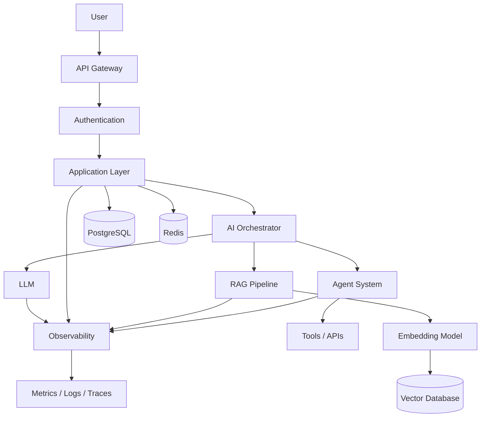

Understanding the model alone is not enough.

You also need to understand:

- APIs
- databases
- networking
- authentication
- retrieval
- embeddings
- model inference
- agents
- queues
- caching
- observability
- security
- deployment
- scaling
- cost
- reliability
- evaluation

This handbook is designed to connect those concepts into one coherent engineering discipline.

---

# 🚀 Why This Handbook?

AI knowledge is fragmented.

You can find:

- Python tutorials
- ML courses
- Transformer papers
- RAG tutorials
- Agent frameworks
- MCP documentation
- Kubernetes courses
- System design books
- Cloud tutorials
- LLM guides

But learning these topics independently does not automatically teach you how to build a **complete production AI system**.

For example, building an enterprise AI assistant may require:

```text
Python
  +
FastAPI
  +
PostgreSQL
  +
Redis
  +
Authentication
  +
Embeddings
  +
Vector Search
  +
Reranking
  +
LLM
  +
RAG
  +
Tool Calling
  +
Agents
  +
MCP
  +
Queues
  +
Observability
  +
Security
  +
Evaluation
  +
Docker
  +
Kubernetes
```

The handbook exists to connect these technologies.

---

# 🧭 The Learning Philosophy

The handbook follows five principles.

## 1. First Principles

Understand the underlying system before hiding it behind a framework.

Instead of:

> "Use this library to build an agent."

We ask:

> What is an agent?

> Why does it need tools?

> How does tool calling work?

> How does the execution loop work?

> How is state maintained?

> What happens when a tool fails?

Only then introduce frameworks.

---

## 2. Build Everything

Reading is useful.

Building creates understanding.

Every major concept should eventually become:

```text
Concept
   ↓
Small Implementation
   ↓
Experiment
   ↓
Production Pattern
   ↓
Larger Project
```

---

## 3. Production Over Demos

A successful notebook is not necessarily a successful production system.

Production AI introduces problems such as:

- latency
- cost
- reliability
- concurrency
- retries
- rate limits
- security
- observability
- evaluation
- deployment
- scaling
- failure recovery

These are treated as first-class engineering problems.

---

## 4. Understand Trade-offs

There is rarely one universally correct architecture.

For every important technology, the handbook asks:

> What problem does it solve?

> When should you use it?

> When should you avoid it?

> What are the alternatives?

> What does it cost?

> How does it behave at scale?

---

## 5. Learn by Increasing Complexity

Systems become progressively more complex.

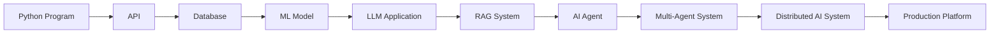

You don't start with Kubernetes.

You first understand why you might eventually need it.

---

# 🗺️ Curriculum

The handbook is organized into progressive volumes.

| Volume   | Focus                            |
| -------- | -------------------------------- |
| **I**    | Computer Science & Python        |
| **II**   | Machine Learning & Deep Learning |
| **III**  | LLM Engineering                  |
| **IV**   | Retrieval-Augmented Generation   |
| **V**    | Multi-Agent AI                   |
| **VI**   | Model Context Protocol           |
| **VII**  | Production AI Infrastructure     |
| **VIII** | AI Projects & System Design      |

See [`curriculum.md`](./curriculum.md) for the complete curriculum.

---

# 📘 Volume I — Computer Science & Python

Build the software engineering foundation required for AI systems.

### Core Topics

- Python
- Advanced Python
- Type Systems
- OOP
- SOLID
- Design Patterns
- Async Programming
- Concurrency
- Memory Management
- Testing
- Logging
- Packaging
- Data Structures
- Algorithms
- Operating Systems
- Networking
- Databases
- Linux
- Git
- Docker
- CI/CD

### Projects

```text
CLI Assistant
REST API
Async Web Scraper
Chat History Manager
FastAPI Service
Redis Cache
Dockerized Application
```

---

# 📗 Volume II — Machine Learning & Deep Learning

Understand the mathematical and computational foundations behind modern AI.

### Topics

- Linear Algebra
- Probability
- Statistics
- Optimization
- Regression
- Classification
- Decision Trees
- Ensemble Methods
- Clustering
- Neural Networks
- Backpropagation
- CNNs
- RNNs
- LSTMs
- Attention
- Transformers
- PyTorch
- Computer Vision
- NLP

### Projects

```text
Digit Classifier
Image Classifier
Sentiment Classifier
Spam Detector
Neural Machine Translation
Custom Transformer
Vision Pipeline
```

---

# 📙 Volume III — LLM Engineering

Move from machine learning to modern language-model systems.

### Topics

- Tokenization
- Embeddings
- Attention
- Transformers
- Context Windows
- Prompt Engineering
- Structured Outputs
- Function Calling
- Tool Calling
- Fine-Tuning
- LoRA
- Quantization
- Inference
- Batching
- Evaluation
- Cost Optimization

### Projects

```text
AI Chatbot
Document Summarizer
AI Email Assistant
Code Assistant
LLM Gateway
Model Router
```

---

# 📕 Volume IV — Retrieval-Augmented Generation

Understand how AI systems retrieve external knowledge.

### Topics

- Embeddings
- Chunking
- Document Processing
- Metadata
- Vector Databases
- Similarity Search
- BM25
- Hybrid Search
- Reranking
- Context Compression
- Query Transformation
- Knowledge Graphs
- GraphRAG
- Agentic RAG
- Retrieval Evaluation

### RAG Architecture

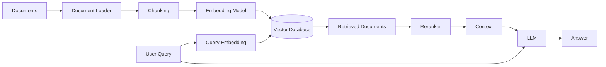

### Projects

```text
Enterprise Knowledge Base
Documentation Search
Research Assistant
Legal RAG
Domain Knowledge Assistant
GraphRAG System
Production RAG API
```

---

# 📒 Volume V — Multi-Agent AI

Move from individual LLM calls to systems capable of coordinating multiple specialized agents.

### Topics

- Agent Architecture
- Planning
- Tool Calling
- State
- Memory
- Reflection
- Task Decomposition
- Agent Communication
- Orchestration
- Human-in-the-Loop
- LangGraph
- CrewAI
- OpenAI Agents SDK
- Google ADK

### Agent Architecture

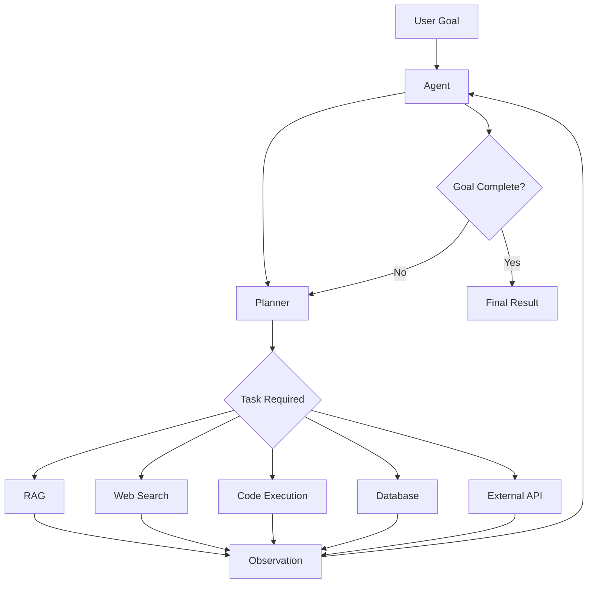

### Projects

```text
Research Agent
Coding Agent
Browser Agent
Customer Support Agent
AI Software Team
Multi-Agent Research Platform
```

---

# 📓 Volume VI — Model Context Protocol

Understand how AI systems connect models to external tools and data.

### Topics

- MCP Architecture
- MCP Clients
- MCP Servers
- Tools
- Resources
- Prompts
- Transport
- Authentication
- Authorization
- Streaming
- Security
- Deployment

### MCP Concept

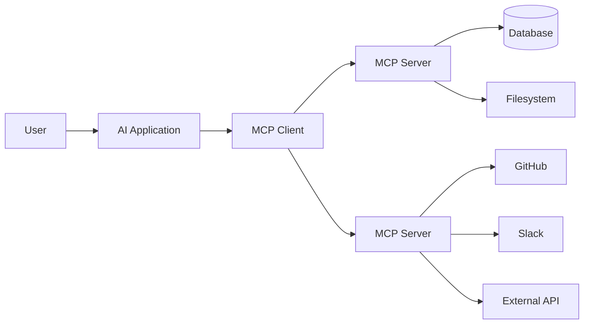

### Projects

```text
Filesystem MCP Server
PostgreSQL MCP Server
GitHub MCP Server
Slack MCP Server
Calendar MCP Server
Multi-Server MCP Platform
```

---

# 📔 Volume VII — Production AI Infrastructure

Learn how to operate AI systems in real production environments.

### Topics

- FastAPI
- PostgreSQL
- Redis
- Kafka
- RabbitMQ
- Docker
- Kubernetes
- GPU Infrastructure
- vLLM
- LiteLLM
- Model Routing
- Caching
- Queues
- Load Balancing
- Rate Limiting
- OpenTelemetry
- Logging
- Metrics
- Tracing
- Security
- CI/CD
- Cost Optimization
- Scaling

### Production Architecture

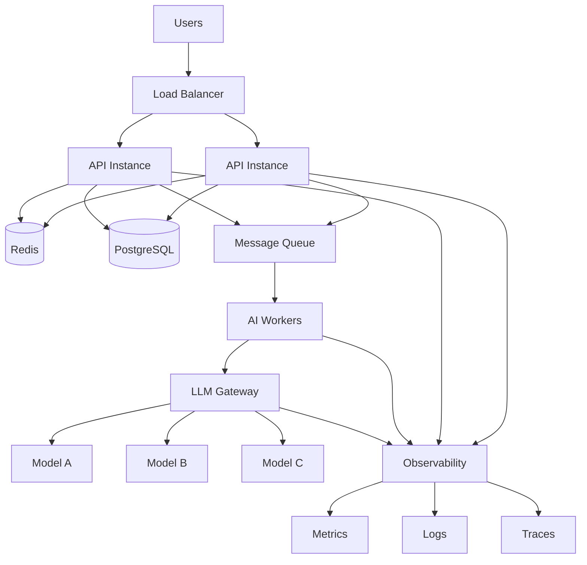

### Projects

```text
AI Gateway
LLM Router
GPU Inference Service
Distributed AI Worker
AI Observability Platform
Multi-Model Platform
```

---

# 📖 Volume VIII — AI Projects & System Design

The final stage combines everything.

Projects are designed around realistic engineering problems rather than isolated demos.

### Capstone Projects

| Project                     | Core Concepts                   |
| --------------------------- | ------------------------------- |
| **ChatGPT Clone**           | LLMs, streaming, conversations  |
| **Perplexity-style Search** | Search, RAG, citations          |
| **AI Notebook**             | Documents, RAG, agents          |
| **Coding Assistant**        | LLMs, tools, code execution     |
| **Enterprise RAG**          | Retrieval, security, evaluation |
| **Research Platform**       | Agents, search, orchestration   |
| **Customer Support AI**     | RAG, agents, APIs               |
| **AI CRM**                  | Agents, databases, workflows    |
| **AI Analytics Platform**   | SQL, agents, visualization      |

Every major project should include:

- Architecture
- Data flow
- Database schema
- API design
- Authentication
- Error handling
- Evaluation
- Observability
- Security
- Deployment
- Performance
- Cost considerations
- Scaling strategy

---

# 🧩 How the Pieces Fit Together

The real objective is not to memorize technologies.

It is to understand their relationships.

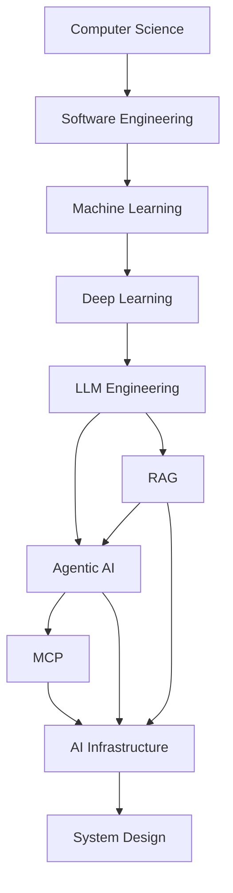

This dependency graph is the heart of the handbook.

---

# 🏗️ The AI Systems Engineering Stack

A useful mental model is to think about AI engineering as a stack.

```text
┌──────────────────────────────────────────────┐
│              AI Applications                │
├──────────────────────────────────────────────┤
│       Agents / Multi-Agent Systems           │
├──────────────────────────────────────────────┤
│          RAG / Retrieval Systems             │
├──────────────────────────────────────────────┤
│            LLM Engineering                   │
├──────────────────────────────────────────────┤
│        ML / Deep Learning / NLP              │
├──────────────────────────────────────────────┤
│      APIs / Databases / Distributed Systems  │
├──────────────────────────────────────────────┤
│        Software Engineering / CS             │
├──────────────────────────────────────────────┤
│          OS / Networking / Linux             │
└──────────────────────────────────────────────┘
```

And surrounding the entire stack:

```text
Security
Observability
Testing
Evaluation
Reliability
Performance
Cost
Deployment
```

---

# 🧪 Learn Through Projects

The handbook is intentionally project-driven.

Instead of learning:

```text
"Here is what Redis is."
```

you eventually build:

```text
Application
   ↓
Cache
   ↓
Redis
   ↓
Measure latency
   ↓
Add expiration
   ↓
Handle cache misses
   ↓
Measure performance
   ↓
Understand the trade-off
```

The same approach applies to:

- RAG
- agents
- databases
- queues
- APIs
- Kubernetes
- model serving
- observability
- distributed systems

---

# 🔬 From Toy System to Production System

A major theme of the handbook is **progressive system evolution**.

For example:

### Stage 1 — Simple LLM App

```text
User → LLM → Response
```

### Stage 2 — RAG

```text
User → Retriever → LLM → Response
```

### Stage 3 — Agent

```text
User → Agent → Tools → LLM → Response
```

### Stage 4 — Production Agent

```text
Users
 ↓
API
 ↓
Auth
 ↓
Agent
 ├── RAG
 ├── Tools
 ├── Memory
 └── APIs
 ↓
Queue
 ↓
Workers
 ↓
LLM Gateway
 ↓
Models
```

### Stage 5 — Distributed AI Platform

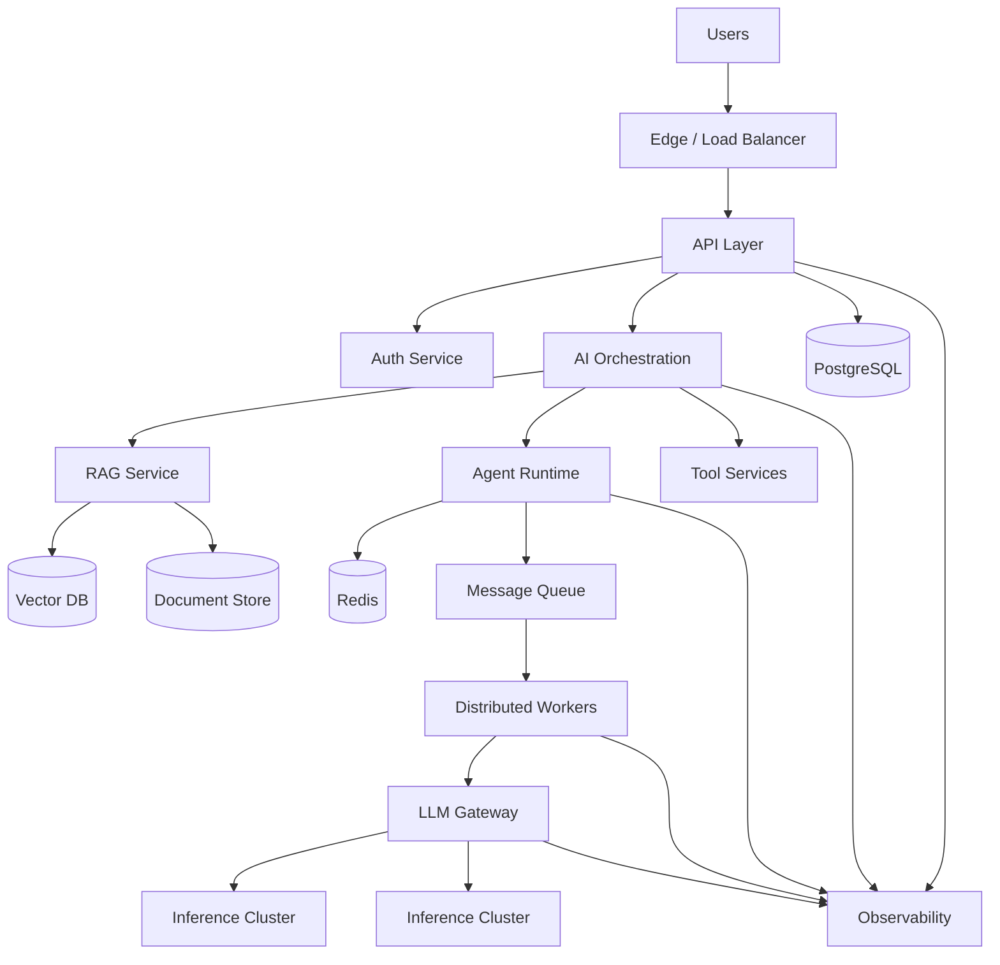

The goal is to understand **why each layer exists**.

---

# 🎓 Learning Outcomes

By working through the handbook, you should be able to:

### Software Engineering

- Write maintainable Python
- Design modular applications
- Build APIs
- Work with databases
- Write tests
- Debug production systems
- Understand concurrency

### AI Engineering

- Understand transformers
- Work with LLMs
- Build RAG pipelines
- Implement retrieval systems
- Build AI agents
- Design multi-agent workflows
- Integrate external tools
- Work with MCP

### Production Engineering

- Containerize applications
- Build asynchronous workers
- Use queues
- Implement caching
- Deploy services
- Monitor systems
- Trace requests
- Optimize latency
- Control AI costs
- Design for failure
- Scale AI workloads

### System Design

You should eventually be able to look at a problem and reason about:

```text
Requirements
     ↓
Architecture
     ↓
Data Flow
     ↓
Components
     ↓
Interfaces
     ↓
Failure Modes
     ↓
Security
     ↓
Observability
     ↓
Scaling
     ↓
Cost
```

---

# 🗂️ Repository Structure

The repository is organized so that theory, implementation, and projects remain connected.

```text
ai-systems-engineer-handbook/
│
├── README.md
├── curriculum.md
├── CONTRIBUTING.md
├── LICENSE
│
├── 01-computer-science-python/
│   ├── python/
│   ├── data-structures/
│   ├── algorithms/
│   ├── operating-systems/
│   ├── networking/
│   ├── databases/
│   └── projects/
│
├── 02-machine-learning/
│   ├── mathematics/
│   ├── classical-ml/
│   ├── deep-learning/
│   ├── pytorch/
│   └── projects/
│
├── 03-llm-engineering/
│   ├── transformers/
│   ├── tokenization/
│   ├── prompting/
│   ├── tool-calling/
│   ├── fine-tuning/
│   └── projects/
│
├── 04-rag/
│   ├── embeddings/
│   ├── chunking/
│   ├── retrieval/
│   ├── reranking/
│   ├── evaluation/
│   └── projects/
│
├── 05-agents/
│   ├── architecture/
│   ├── planning/
│   ├── memory/
│   ├── tools/
│   ├── orchestration/
│   └── projects/
│
├── 06-mcp/
│   ├── architecture/
│   ├── servers/
│   ├── clients/
│   ├── security/
│   └── projects/
│
├── 07-production/
│   ├── docker/
│   ├── kubernetes/
│   ├── databases/
│   ├── queues/
│   ├── inference/
│   ├── observability/
│   └── projects/
│
└── 08-system-design/
    ├── architectures/
    ├── case-studies/
    └── capstone-projects/
```

---

# 🧭 Recommended Learning Order

If you are starting from the beginning:

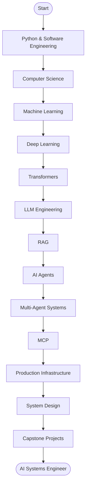

You don't need to master every topic before experimenting.

The roadmap is a guide, not a restriction.

---

# 🧠 What Makes This Different?

The handbook focuses on the **connections between concepts**.

For example:

```text
Embeddings
    ↓
Vector Search
    ↓
RAG
    ↓
Agent
    ↓
Tool Calling
    ↓
MCP
    ↓
Distributed Workers
    ↓
Production AI Platform
```

Each concept becomes more meaningful when you understand what comes before and after it.

---

# ⚙️ Engineering Questions

Throughout the handbook, we repeatedly ask questions such as:

### Architecture

> Why does this component exist?

### Performance

> Where is the bottleneck?

### Reliability

> What happens when this service fails?

### Scaling

> What changes when traffic increases 100×?

### AI Quality

> How do we know the model is actually performing well?

### Retrieval

> How do we know the right context was retrieved?

### Agents

> How do we prevent an agent from taking an incorrect action?

### Cost

> What happens to our infrastructure bill as usage grows?

### Security

> What happens if the model receives malicious input?

### Observability

> How do we debug a failed AI request?

These questions are often more valuable than memorizing APIs.

---

# 🧪 Evaluation Is Part of Engineering

A production AI system cannot be judged only by whether it "works."

We need to measure it.

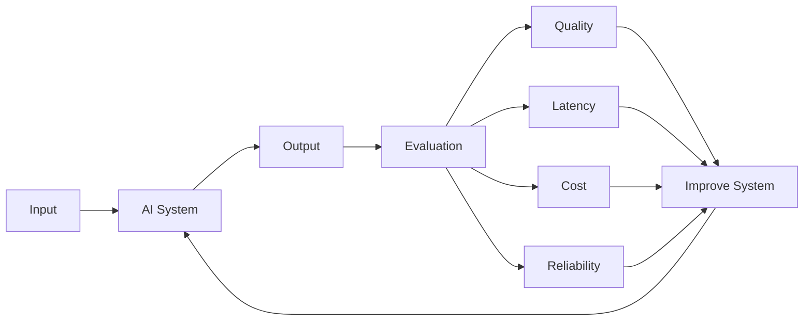

Evaluation should be treated as an engineering loop:

```text
Build
 ↓
Measure
 ↓
Find Failure
 ↓
Improve
 ↓
Measure Again
```

---

# 🛡️ Production Concerns

AI systems introduce unique failure modes.

The handbook covers areas such as:

```text
Prompt Injection
Data Leakage
Hallucination
Incorrect Retrieval
Tool Misuse
Model Failure
API Failure
Rate Limits
Timeouts
Queue Backlogs
Token Explosion
Cost Spikes
Model Drift
Dependency Failures
```

The objective is not to build systems that never fail.

The objective is to understand:

> **How they fail, how to detect failures, and how to recover from them.**

---

# 🌎 Open Source

This handbook is intentionally open source.

The AI ecosystem changes rapidly, and no single person can maintain the best explanation of every topic forever.

Community contributions can improve:

- explanations
- diagrams
- examples
- implementations
- projects
- exercises
- benchmarks
- corrections
- references
- production patterns

If you find something incorrect or outdated, open an issue or submit a pull request.

---

# 🤝 Contributing

Contributions are welcome.

You can contribute by:

- Fixing errors
- Improving explanations
- Adding diagrams
- Adding examples
- Building projects
- Improving code
- Adding exercises
- Adding tests
- Updating outdated material
- Sharing production lessons
- Improving documentation

A good contribution should optimize for:

> **Clarity → Correctness → Practicality**

See [`CONTRIBUTING.md`](./CONTRIBUTING.md).

---

# ⭐ Support the Project

If this handbook helps you learn or build something:

### ⭐ Star the repository

A star helps other engineers discover the project.

### 🍴 Fork it

Build your own learning path or experiment with the projects.

### 🛠️ Contribute

Improve the handbook for the next person.

### 📢 Share it

Share useful chapters, projects, and ideas with other engineers.

Open-source projects become valuable through the people who use and improve them.

---

# 🗺️ The Long-Term Vision

The long-term goal is to build a comprehensive open-source reference for **AI Systems Engineering**.

Not just:

```text
"What is RAG?"
```

But:

```text
Why RAG exists
      ↓
How retrieval works
      ↓
How to implement retrieval
      ↓
How to evaluate retrieval
      ↓
How RAG fails
      ↓
How to build production RAG
      ↓
How RAG integrates with agents
      ↓
How to operate it at scale
```

The same philosophy applies to every layer.

---

# 🚧 Project Status

**Active Development**

The handbook is being developed progressively.

Content, examples, projects, diagrams, and references will continue to evolve as the AI engineering ecosystem changes.

Expect:

- New chapters
- New implementations
- New projects
- Better diagrams
- Updated tooling
- Production case studies
- Community contributions

---

# 📚 Start Here

### 🟢 Beginner

Start with:

```text
Python
 ↓
Data Structures
 ↓
Algorithms
 ↓
SQL
 ↓
HTTP / APIs
 ↓
Git
 ↓
Linux
```

### 🟡 Intermediate

Continue with:

```text
Machine Learning
 ↓
Deep Learning
 ↓
Transformers
 ↓
LLM Engineering
 ↓
RAG
```

### 🔴 Advanced

Then explore:

```text
Agents
 ↓
Multi-Agent Systems
 ↓
MCP
 ↓
Distributed Systems
 ↓
AI Infrastructure
 ↓
System Design
```

### 🏆 Builder

Finally:

```text
Capstone Projects
       ↓
Production Deployment
       ↓
Observability
       ↓
Performance
       ↓
Scaling
       ↓
Real-World AI Systems
```

---

# 💬 The Core Idea

The handbook can be summarized in one sentence:

> **Don't just learn how to call an AI model — learn how to engineer the systems around it.**

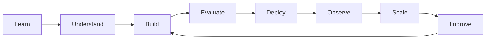

---

<div align="center">

# 🧠 Learn the Foundations. Build the Systems. Engineer the Future

**The AI Systems Engineer Handbook**

Open Source · Community Driven · Built by Engineers

<br/>

⭐ **Star the repository if you're building your AI engineering journey.**

</div>

---

## 📜 License

This project is licensed under the **MIT License**.

See [`LICENSE`](./LICENSE) for details.

---

<div align="center">

**Made with curiosity, engineering, and a lot of debugging.**

</div>
